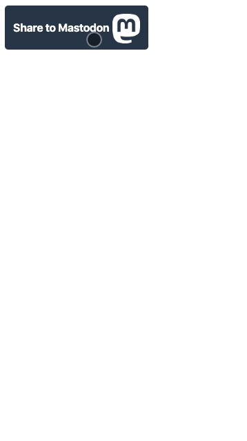

![Built With Stencil](https://img.shields.io/badge/-Built%20With%20Stencil-16161d.svg?logo=data%3Aimage%2Fsvg%2Bxml%3Bbase64%2CPD94bWwgdmVyc2lvbj0iMS4wIiBlbmNvZGluZz0idXRmLTgiPz4KPCEtLSBHZW5lcmF0b3I6IEFkb2JlIElsbHVzdHJhdG9yIDE5LjIuMSwgU1ZHIEV4cG9ydCBQbHVnLUluIC4gU1ZHIFZlcnNpb246IDYuMDAgQnVpbGQgMCkgIC0tPgo8c3ZnIHZlcnNpb249IjEuMSIgaWQ9IkxheWVyXzEiIHhtbG5zPSJodHRwOi8vd3d3LnczLm9yZy8yMDAwL3N2ZyIgeG1sbnM6eGxpbms9Imh0dHA6Ly93d3cudzMub3JnLzE5OTkveGxpbmsiIHg9IjBweCIgeT0iMHB4IgoJIHZpZXdCb3g9IjAgMCA1MTIgNTEyIiBzdHlsZT0iZW5hYmxlLWJhY2tncm91bmQ6bmV3IDAgMCA1MTIgNTEyOyIgeG1sOnNwYWNlPSJwcmVzZXJ2ZSI%2BCjxzdHlsZSB0eXBlPSJ0ZXh0L2NzcyI%2BCgkuc3Qwe2ZpbGw6I0ZGRkZGRjt9Cjwvc3R5bGU%2BCjxwYXRoIGNsYXNzPSJzdDAiIGQ9Ik00MjQuNywzNzMuOWMwLDM3LjYtNTUuMSw2OC42LTkyLjcsNjguNkgxODAuNGMtMzcuOSwwLTkyLjctMzAuNy05Mi43LTY4LjZ2LTMuNmgzMzYuOVYzNzMuOXoiLz4KPHBhdGggY2xhc3M9InN0MCIgZD0iTTQyNC43LDI5Mi4xSDE4MC40Yy0zNy42LDAtOTIuNy0zMS05Mi43LTY4LjZ2LTMuNkgzMzJjMzcuNiwwLDkyLjcsMzEsOTIuNyw2OC42VjI5Mi4xeiIvPgo8cGF0aCBjbGFzcz0ic3QwIiBkPSJNNDI0LjcsMTQxLjdIODcuN3YtMy42YzAtMzcuNiw1NC44LTY4LjYsOTIuNy02OC42SDMzMmMzNy45LDAsOTIuNywzMC43LDkyLjcsNjguNlYxNDEuN3oiLz4KPC9zdmc%2BCg%3D%3D&colorA=16161d&style=flat-square)

# Mastodon share button

This package is a user friendly web component to share to mastodon.

## Browsers support

| [](http://godban.github.io/browsers-support-badges/)</br>IE / Edge | [](http://godban.github.io/browsers-support-badges/)</br>Firefox | [](http://godban.github.io/browsers-support-badges/)</br>Chrome | [](http://godban.github.io/browsers-support-badges/)</br>Safari | [](http://godban.github.io/browsers-support-badges/)</br>iOS Safari | [](http://godban.github.io/browsers-support-badges/)</br>Samsung |
| --------- | --------- | --------- | --------- | --------- | --------- |
| IE11 *([limited](docs/ie.md))*, Edge| last 2 versions| last 2 versions| last 2 versions| last 2 versions| last 2 versions

# Preview



# Getting Started
## Installation
### Via CDN
```html
<script src="https://unpkg.com/mastodon-share-button@1.0.0/dist/mastodon-share/mastodon-share.js"></script>
```
### Via NPM
```bash
$ npm install mastodon-share-button 
```
### Usage

```html
<!-- Simple use -->
<mastodon-share-button share_message="Text to share"></mastodon-share-button>

<!-- Customized -->
<mastodon-share-button
    instances='["https://mastodon.eus", "https://mastodon.jalgi.eus"]'
    share_message="Text to share"
    share_button_text="Custom share button text"
    close_button_text="Custom close text"
    send_button_text="Custom send text"
    modal_title="Custom modal title"
    other_instance_text="Custom other instance select option text"
    dark_mode="true">
</mastodon-share-button>
```

# Documentation
<!-- ### Frameworks support -->

<!-- * [React](docs/installation/react.md)
* [Angular](docs/installation/angular.md)
* [Vue](docs/installation/vue.md) -->

